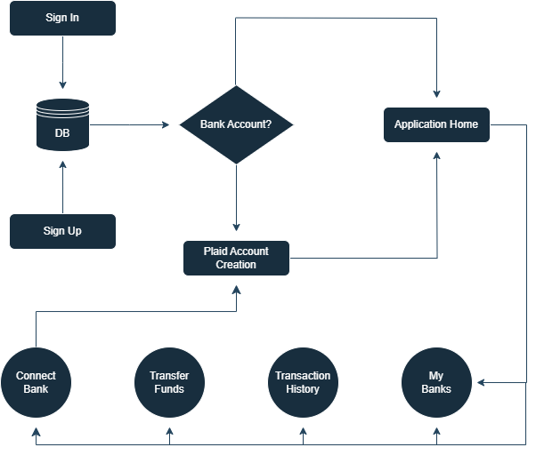

<div align = center>

# - SmartAccount -

<br>

<p>
  | &nbsp &nbsp &nbsp Kyle Smith and Bradin Gentry &nbsp &nbsp &nbsp |
</p>

<a name="download"></a>
<br>


<br>
<br>
<br>

[<kbd> <br> VISIT APPLICATION <br> </kbd>][KBD]

<br>

[<kbd> <br> GO TO DOCUMENTATION <br> </kbd>][GOTO]

</div>

<br>
<br>

<!--------------------------------- Documentation Table ------------------------------------------->

<a name="documentation"></a>
### Documentation
<ul>
  <li><a href="#about">SmartAccount About 📜</a></li>
  <li><a href="#requirements">SmartAccount Requirements 📑</a></li>
  <li><a href="#download">SmartAccount Access 🔧</a></li>
  <li><a href="#inner-workings">SmartAccount Inner Workings :gear:</a></li>
  <li><a href="#recognition">SmartAccount Recognition :sparkles:</a></li>
  <li><a href="#future-developments">SmartAccount Future Developments :ballot_box_with_check:</a></li>
</ul>

<br>
<br>

<!--------------------------------- About ------------------------------------------->

<a name="about"></a>
### SmartAccount About 📜
Do you need to manage your finances? SmartAccount is an application that allows users to manage and track finances through real-world banking accounts. With this application, you can view details about your balance, income, and expenses—such as the amount, category, date of each transaction, and more!
<br>

<li></li><br>

Each bank account you create will be stored on our server, hosted by [Appwrite](https://appwrite.io/). Appwrite ensures the authenticity and secure transmission of account information.

<br>
<br>

<!--------------------------------- Requirements ------------------------------------------->

<a name="requirements"></a>
### SmartAccount Requirements 📑
This software meets the requirements illustrated in the guidelines here: [FBLA GUIDELINES](https://connect.fbla.org/headquarters/files/High%20School%20Competitive%20Events%20Resources/Individual%20Guidelines/Presentation%20Events/Coding-and-Programming.pdf)

- [x] The application should be easily accessible and usable for the user.
  - Application has intuitive and manageable user interfaces.
- [x] The application should have features detailed in the requirements.
  - Application can validate user input, provide bank account information, filter categorized information, and has other options.
- [x] The application should store data that the user provides.
  - Application securely stores data on our Appwrite server.

<br>
<br>

<!--------------------------------- Inner Workings ------------------------------------------->

<a name="inner-workings"></a>
### SmartAccount Inner Workings :gear:
This application is structured in the following steps:
1. The user generates an account or authenticates themself.
2. The user integrates their bank account into the application.
3. Information is exchanged between the user and application securely and cannot be viewed by others, including the development team.
4. The user can view their transactions and manage bank accounts.

<br>

Below are example environment variables used in the application and their specific use case:

```ts
#NEXT
NEXT_PUBLIC_SITE_URL="https://smartaccount-fbla.vercel.app/"     // Site for deployment

#APPWRITE
NEXT_PUBLIC_APPWRITE_ENDPOINT="https://cloud.appwrite.io/v1"     // Site for Appwrite endpoint fetching
NEXT_PUBLIC_APPWRITE_PROJECT="<>"                                // ID for this application in Appwrite
APPWRITE_DATABASE_ID="<>"                                        // ID for database
APPWRITE_USER_COLLECTION_ID="<>"                                 // ID for user data
APPWRITE_BANK_COLLECTION_ID="<>"                                 // ID for bank data
APPWRITE_TRANSACTION_COLLECTION_ID="<>"                          // ID for transaction data
NEXT_APPWRITE_KEY="<>"                                           // Private key for Appwrite and client communication 

#PLAID
PLAID_CLIENT_ID="<>"                                             // ID for this application in Plaid
PLAID_SECRET="<>"                                                // Secret for this application in Plaid
PLAID_ENV="sandbox"                                              // Development type for Plaid { sandbox, development, production }
PLAID_PRODUCTS="auth,transactions,identity"                      // Product types for client
PLAID_COUNTRY_CODES="US,CA"                                      // Banks within countries codes

#DWOLLA
DWOLLA_KEY="<>"                                                  // Private key for Dwolla and Plaid communication
DWOLLA_SECRET="<>"                                               // Secret for this application in Dwolla
DWOLLA_BASE_URL="https://api-sandbox.dwolla.com"                 // Site for Dwolla endpoint fetching
DWOLLA_ENV="sandbox"                                             // Development type for Dwolla { sandbox, production }
```

<br>

Below is a simplified diagram of what the application looks like logically:



<br>
<br>

<!--------------------------------- Recognition ------------------------------------------->

<a name="recognition"></a>
### SmartAccount Recognition :sparkles:
We used the following applications for our project:
<br>


<br><b>Nextjs</b>: The framework of the application.
<br><b>Shadcn</b>: Provided useful UI components.
<br><b>TailwindCSS</b>: Provided Pre-defined CSS classes for Shadcn.
<br><b>Chartjs</b>: Library that the application used for its charts.
<br><b>Appwrite</b>: The database of the application for user data.
<br><b>Sentry</b>: A developer analytics tools for debugging.
<br><b>Vercel</b>: Our hosting platform for our application.
<br><b>Plaid</b>: Third-party component in the application for integrating real-world banks.
<br><b>Dwolla</b>: Used by Plaid to access user information for the banks.

-

<b>Tutorial by JavaScript Mastery</b>: https://www.youtube.com/watch?v=PuOVqP_cjkE

<br>
<br>

<!--------------------------------- Future Developments ------------------------------------------->

<a name="future-developments"></a>
### SmartAccount Future Developments :ballot_box_with_check:
- [ ] Improve Resource Loading and Processing Management
- [ ] Create a Q&A
- [ ] Downloadable Report
- [ ] More Customization
- [ ] Go into Production

<br>

<hr>
<hr>

<!--------------------------------- Variables ------------------------------------------->

[KBD]: https://smartaccount-fbla.vercel.app/
[GOTO]: #documentation
